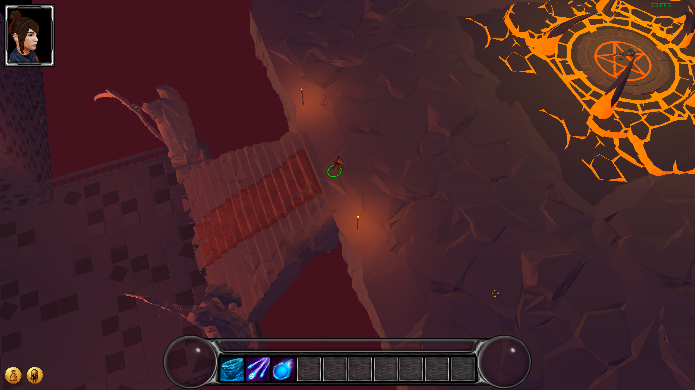
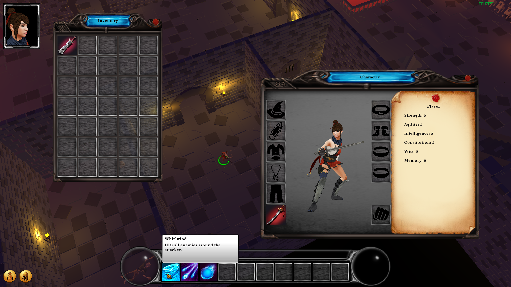
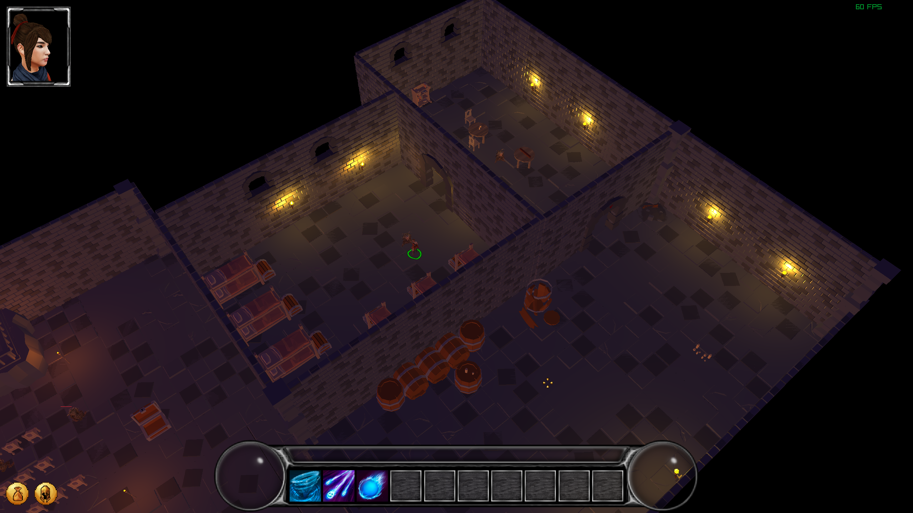
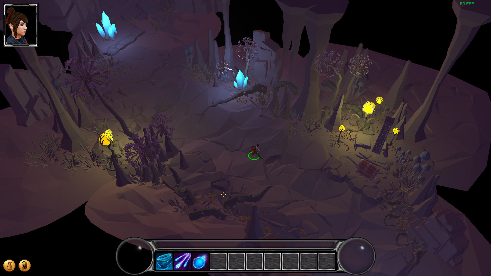
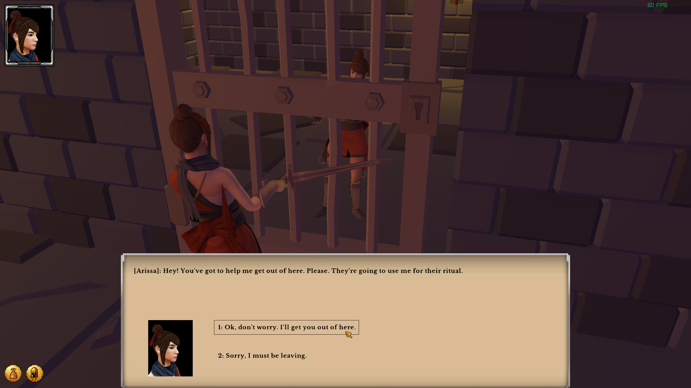
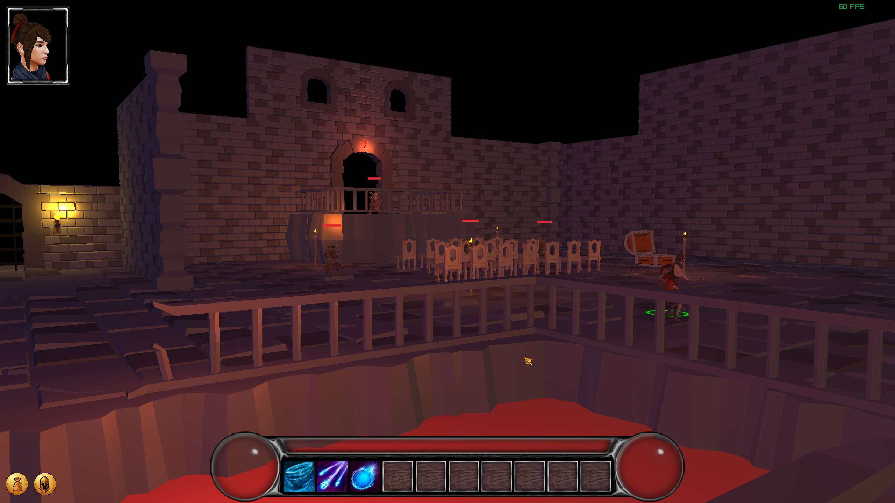

# 'LeverQuest'- RPG Game/Engine

[Click here for a video demonstration](https://www.youtube.com/watch?v=CgDjyCZQcbo)

The objective of this project was to create a vertical slice of a Baldur's Gate 3/Divinity: Original Sin 2-inspired CRPG
without using a game engine, such as Unity or Unreal. Instead, I built the engine on top of the low-level 'raylib'
library in C++, primarily using raylib for window management and rendering. The goal was to learn how to build systems
and tools from scratch, which I take for granted when using large-scale game engines, such as pathfinding, particle
systems, visual effects, or serialisation.

In this demo, the player awakens in a cave and must navigate through a goblin cult that has occupied an underground
dungeon. The player must repair a lever that opens their escape route through a series of quest chains to leave the
dungeon area. Due to this, the demo was dubbed 'LeverQuest.'

Please note: To build this project you will need to provide your own assets.

## Features

- Dialog system with custom markup language and parser for quest logic and conditionals.
- Custom UI Library imitating HTML table layout logic, including the ability to drag and drop icons contextually.
- Multi-unit A*/BFS Pathfinding system with navigation resolution.
- 3D billboarded particle system.
- JSON/Binary serialisation.
- Quest system with event handling.
- Lighting system.
- Inventory/item system with equippable items.
- Blender-to-engine asset pipeline.

## Screenshots

The purpose of this repository is to showcase the underlying code of this engine to potential employers and those
interested in its inner-workings. This repository is source-available for viewing and demonstration purposes only. The
code is not currently open source.

Copyright © 2025. All rights reserved.