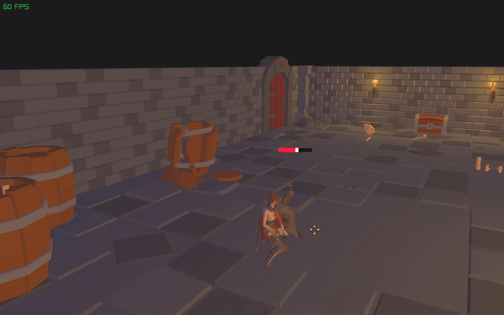

# Action RPG Game/Engine

[Click here for a video demonstration]("https://www.youtube.com/embed/r-uz78O3suk?si=V0p-T_p45XrW0Ecw")

The beginnings of an action RPG engine written in C++, using raylib and entt as its foundations. The end goal is to have
similar gameplay to 'Dungeon Siege' or 'Torchlight' (but much smaller in scale). Currently, model loading, animations,
camera movement, contextual cursors, pathfinding and the beginnings of an combat, state and dialogue system have been
implemented.

## Screenshots

